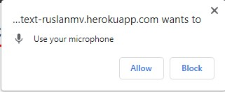

# Recording Audio and Transcribing with OpenAI API using Flask

This application allows you to record audio through the browser and transcribe it into text using an API.

First clone the main programs

```
git clone https://github.com/draguitar/WebRecoderGPT.git
```

we enter to the folder

```
cd WebRecoderGPT
```


```
pip install -r requirements.txt
```


We can see that the app.py file contains the information relevant to convert audio to text

**app.py**

```python
from flask import Flask, render_template, request, redirect
import speech_recognition as sr

app = Flask(__name__)


@app.route("/", methods=["GET", "POST"])
def index():
    transcript = ""
    if request.method == "POST":
        print("FORM DATA RECEIVED")

        if "file" not in request.files:
            return redirect(request.url)

        file = request.files["file"]
        if file.filename == "":
            return redirect(request.url)

        if file:
            recognizer = sr.Recognizer()
            audioFile = sr.AudioFile(file)
            with audioFile as source:
                data = recognizer.record(source)
            transcript = recognizer.recognize_google(data, key=None)

    return render_template('index.html', transcript=transcript)


if __name__ == "__main__":
    app.run(debug=True, threaded=True)
```

The entry point to the application, wsgi.py


**wsgi.py**

```
from app import app
if __name__ == "__main__":
  app.run()
```

We can  run the application in your local system

```
% python wsgi.py
```

and verify that it works locally

This has the following requirements.txt


we requiere a  **runtime.txt** file


```
python-3.10.14
```

To record the audio I have used a simple HTML/JS demo that uses [WebAudioRecorder.js](https://github.com/higuma/web-audio-recorder-js) to record wav  a web page.


If you enter, you should wait at least one minute to initialize the application.


The current version of the application  work with **4 steps**


**Step 1**: Record your voice with your microphone





You should allow use your microphone. and when you finish to record press **stop**


**Step2** . Download your file to your desktop


Step 3. Upload your wave file and then


Step 4 press transcribe button and you see the results


**Congratulation!** You were able to create a web app that can convert your audio to text

